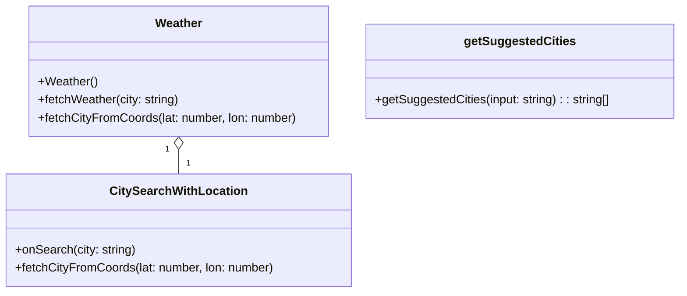

# Weather.tsx Documentation

---

## 📚 Index

1. [Overview](#overview)
2. [Component Architecture](#component-architecture)
3. [External APIs Used](#external-apis-used)
4. [Detailed Component Breakdown](#detailed-component-breakdown)
    - [`Weather`](#weather-component)
    - [`CitySearchWithLocation`](#citysearchwithlocation-component)
    - [Utility: `getSuggestedCities`](#utility-getsuggestedcities)
5. [Installation](#Installation)
6. [UI & User Experience](#ui--user-experience)
7. [Props & Types Table](#props--types-table)
8. [Dependencies](#dependencies)
9. [License](#license)

---

## Overview

A responsive weather forecast application built with React, TypeScript, and modern web technologies. The app provides current weather conditions and a 5-day forecast with an interactive temperature chart.


- Auto-detects the user's location via browser geolocation 🌎.
- Allows users to search weather by city name or select from popular suggestions 🏙️.
- Visualizes a 5-day weather forecast with temperature trends using charts 📈.
- Uses **WeatherAPI** and **BigDataCloud** for weather and reverse geolocation, respectively.

---

## Component Architecture

**Main Components:**



---

## External APIs Used

| API Name                | Purpose                   | Endpoint Example                                                                                   | Docs Link                                                    |
|-------------------------|---------------------------|----------------------------------------------------------------------------------------------------|--------------------------------------------------------------|
| WeatherAPI              | Weather forecast data     | https://api.weatherapi.com/v1/forecast.json?key=API_KEY&q=City&days=5&aqi=no&alerts=no           | https://www.weatherapi.com/docs/                             |
| BigDataCloud            | Reverse geocoding         | https://api.bigdatacloud.net/data/reverse-geocode-client?latitude={lat}&longitude={lon}&localityLanguage=en | https://www.bigdatacloud.com/docs/api/reverse-geocode-client |

---

## Detailed Component Breakdown

### Weather Component

#### Responsibilities

- Top-level component; maintains the selected city and its weather data in state.
- Fetches city based on user’s geolocation.
- Fetches weather data from WeatherAPI.
- Renders the search UI, current weather, a temperature trend chart, and a 4-day forecast summary.

#### Key Functions

- **fetchCityFromCoords:** Uses latitude and longitude to determine the city via reverse geocoding.
- **fetchWeather:** Given a city, fetches 5-day weather forecast.
- **useEffect Hooks:** Trigger city/weather fetches on mount and when dependencies change.

#### Render Structure

- Search box and suggested cities.
- Current weather summary (icon, temp, humidity, wind).
- Temperature trend line chart (°C and °F).
- 4-day weather forecast cards.

---

## Installation
1. Clone the repository:
   ```bash
   git clone https://github.com/your-username/weather-forecast-app.git
   cd weather-forecast-app
2. Install dependencies:
```bash
  npm install

```
3. Start the development server:
```
npm start
```
----
#### Responsibilities

- Handles city input, suggestion, and geolocation-based city detection.
- Provides search interface, suggestions dropdown, and quick select buttons for popular cities.

#### Key Functions

- **fetchCityFromCoords:** (Similar to above) Detects city from current geolocation.
- **getSuggestedCities:** Filters and suggests city names based on input or region.
- **Debounced suggestions:** (300ms delay) For efficient and UX-friendly suggestions

### Utility: getSuggestedCities

A simple city suggestion engine that:

- Suggests city groups by region if input matches region names.
- Otherwise, filters all cities for matches.
- Defaults to a popular set if no match is found.

---

## UI & User Experience

- **Responsive and visually appealing**: Uses Tailwind CSS utility classes for modern look.
- **Debounced search suggestions**: Avoids overwhelming the user and API.
- **Charting**: Uses Recharts for interactive line charts.
- **Graceful geolocation fallback**: If geolocation fails, defaults to "Lagos".

---

## Props & Types Table

| Name                | Type                                      | Description                                    |
|---------------------|-------------------------------------------|------------------------------------------------|
| WeatherData         | `{current, forecast}`                     | Main weather data API response                 |
| CityGroups          | `{ [region: string]: string[] }`          | Mapping of region names to city arrays         |
| CitySearchWithLocationProps | `{ onSearch: (city: string) => void }` | Callback triggered when searching for weather  |

---

### WeatherData Structure

| Property        | Type                              | Example/Description            |
|-----------------|-----------------------------------|-------------------------------|
| current         | `{ temp_c, condition, humidity, wind_kph }` | Current weather details       |
| forecast        | `{ forecastday: Array }`          | 5-day forecast summary        |

---

## Dependencies

- **react, react-dom**: Core React
- **react-use**: For geolocation hook
- **axios**: HTTP requests
- **recharts**: Chart visualization
- **tailwindcss**: Styling

---

## License  
>  MIT

---

